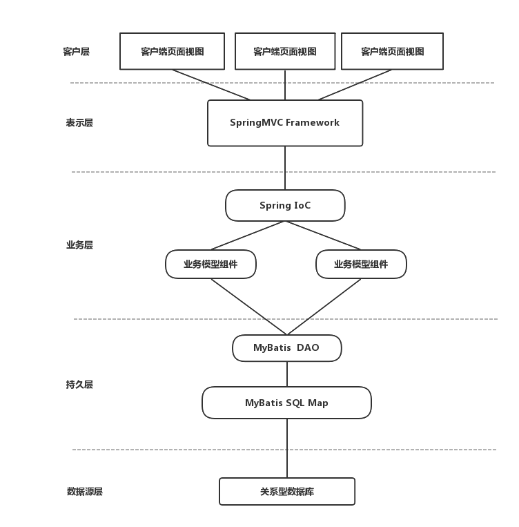

### Web应用架构设计

#### 架构模式

每一个模式都描述了一个在我们周围不断重复发生的问题及该问题解决方案的核心。这样，你就能一次又一次地用该方案而不必做重复工作 。

接下来说说本项目“知否”的网站架构模式。

#### 层次架构

分层是企业应用系统中最常见的一种架构模式，将系统在 **横向维度** 上切分成几个部分，每个部分负责一部分相对比较单一的职责，然后 **通过上层对下层的依赖和调用** 组成一个完整的系统。

| 分层   | 功能                           |
| ---- | ---------------------------- |
| 应用层  | 负责具体业务和视图展示，如网站首页以及搜索输入和结果展示 |
| 服务层  | 为应用层提供服务支持，如用户管理服务，购物车服务     |
| 数据层  | 提供数据存储访问服务，如数据库、缓存、文件、搜索引擎等  |

分层架构 还可以细分下去 ，比如说应用层可以细分为**视图层**和**业务逻辑层**。服务层可以细分为**数据接口层**和**逻辑处理层**。

分层结构对网站支持高并发向分布式发展至关重要，所以 在网站规模很小的时候就应该采用分层的架构，这样将来网站做大时才能有更好地应对 。

#### 1基于Spring+Mybitas的轻量级Web应用框架

#### 1.1应用层

前端页面技术html+css+javascript。通过http协议与后端进行交互。

Velocity是一个基于java的模板引擎（template engine）。它允许任何人仅仅简单的使用模板语言（template language）来引用由java代码定义的对象。 

当Velocity应用于web开发时，界面设计人员可以和java程序开发人员同步开发一个遵循MVC架构的web站点，也就是说，页面设计人员可以只 关注页面的显示效果，而由java程序开发人员关注业务逻辑编码。Velocity将java代码从web页面中分离出来，这样为web站点的长期维护提 供了便利，同时也为我们在JSP和PHP之外又提供了一种可选的方案。 同时利用velocity引擎，使得页面渲染更加方便。

#### 1.2服务层

使用Spring框架，Spring框架是一个基于loC和AOP(面向方面编程)的构架。采用IoC使得它可以很容易地实现bean的装配，提供了简洁的AOP并据此实现事务管理等，但是它不具备处理应用分布式的能力。Spring的核心要点是：支持不绑定到特定J2EE服务的可重用业务和数据访问对象。这样的对象可以在不同J2EE环境(Web或EJB)、独立应用程序、测试环境之间重用。

#### 1.3数据层

主流框架有MyBatis和Hibernate,我们使用MyBatis，MyBatis是一个简易的SQL Map工具，它是将手工编写的在xml配置文件中的SQL语句映射成Java对象。使用MyBatis提供的O／R Mapping机制，对业务逻辑实现人员而言，面对的是纯粹的Java对象，这一层与通过Hibernate实现O／R Mapping而言基本一致，而对于具体的数据操作，Hibernate会自动生成SQL语句，而iBATIS则要求开发者编写具体的SQL语句。相对Hibernate等“全自动”O／R Mapping机制而言，iBATIS以SQL开发的工作量和数据库移植性上的让步，为系统设计提供了更大的自由空间。我们采用MyBatis作为持久层框架，充分发挥其自由灵活的特点。

